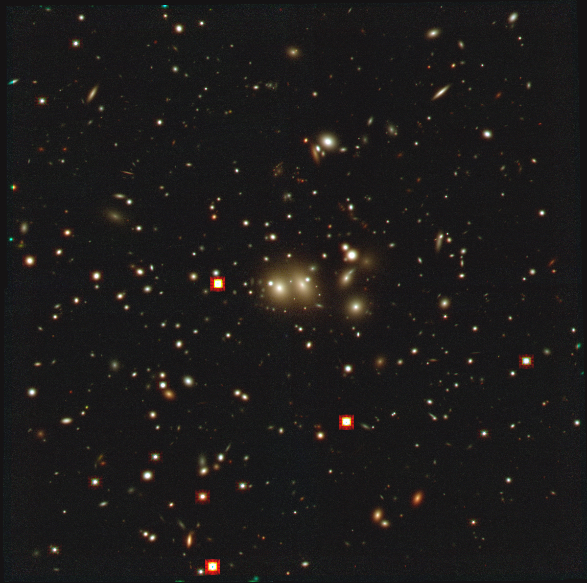

# Simulating JWST NIRCam images of a galaxy cluster with MIRAGE

MIRAGE simulated NIRCam images of the galaxy cluster MACS0647+70 and the triply-lensed z=11 candidate MACS0647-JD

JWST GO 1433 public data upcoming Nov 2022

7 filters: F115W F150W F200W F277W F356W F444W F480M  
0.04" / pixel  
slight misalignments between short and long wavelength images  
4 dithers INTRAMODULEX covers short wavelength detector gaps  
F200W has 2 epochs (8 exposures)  

CLASH HST F160W Sersic fits

NIRCam predicted fluxes from BAGPIPES SED fitting to CLASH HST 17-band photometry  

✔ [HST catalog & Sersic fits](https://github.com/dancoe/mirage/blob/master/MACS0647%20Galaxies%20HST%20Sersic%20fits.ipynb) – (Astropy.photutils, Astropy.modeling)  
✔ NIRCam predicted fluxes in each filter – (BAGPIPES)  
✔ [NIRCam simulated images](https://github.com/dancoe/mirage/blob/master/Simulate%20NIRCam%20Images%20MACS0647%20F277W.ipynb) – (MIRAGE)  
✔ [Processed & combined](https://github.com/dancoe/mirage/blob/master/Reduce%20NIRCam%20Simulated%20Images%20MACS0647%20F277W.ipynb) – (JWST Pipeline; CEERS tips & scripts)  
✔ [Color images](https://github.com/dancoe/mirage/blob/master/Trilogy%20color%20images%20NIRCam%20MACS0647.ipynb) – Trilogy (updated for Python 3 notebook)  
✔ NIRCam PSF-matched multiband photometry  
✔ [Inspect NIRCam photometry](https://github.com/dancoe/mirage/blob/master/MACS0647%20NIRCam%20photometry%20results.ipynb)  

Inputs:
* [CLASH](https://archive.stsci.edu/prepds/clash/) [HST images of MACS0647](https://archive.stsci.edu/missions/hlsp/clash/macs0647/data/hst/scale_65mas/)
* [cleaned segmentation map of detections](https://github.com/dancoe/mirage/blob/master/z11_seg_cleaned.fits.gz)
* APT outputs: [XML](https://github.com/dancoe/mirage/blob/master/JWSTz11_NIRCam.xml), [pointing](https://github.com/dancoe/mirage/blob/master/JWSTz11_NIRCam.pointing)

To do list:  
? Add lensed fainter & higher-z galaxies – (e.g., Aaron Yung SAMs)  
☐ Incorporate HST images to photometry + SED fitting  
☐ Galaxy detection & analysis – (Astropy.photutils, BAGPIPES)  

https://stsci.box.com/v/coe-nircam-mirage

https://github.com/dancoe/mirage

https://dancoe.space/jwst/simulations

